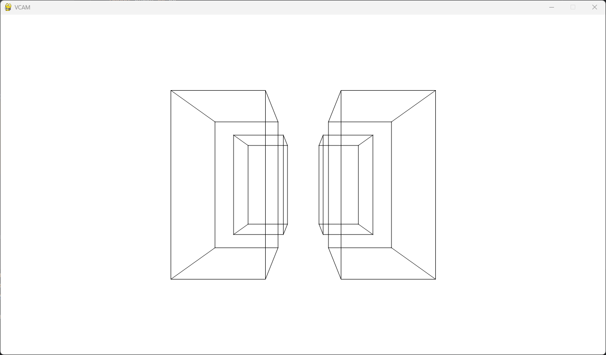
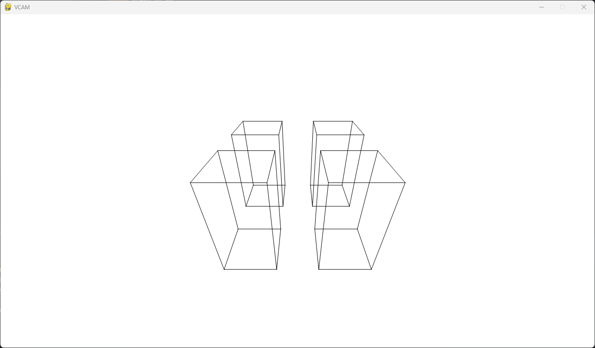
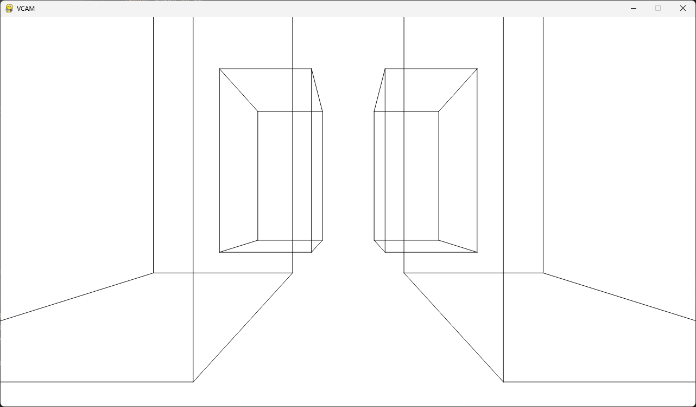
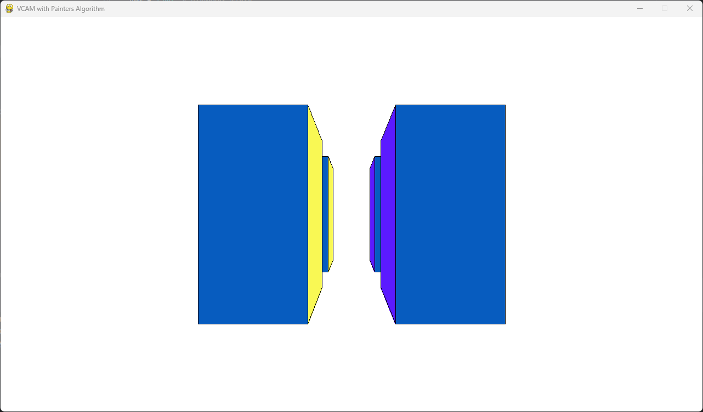
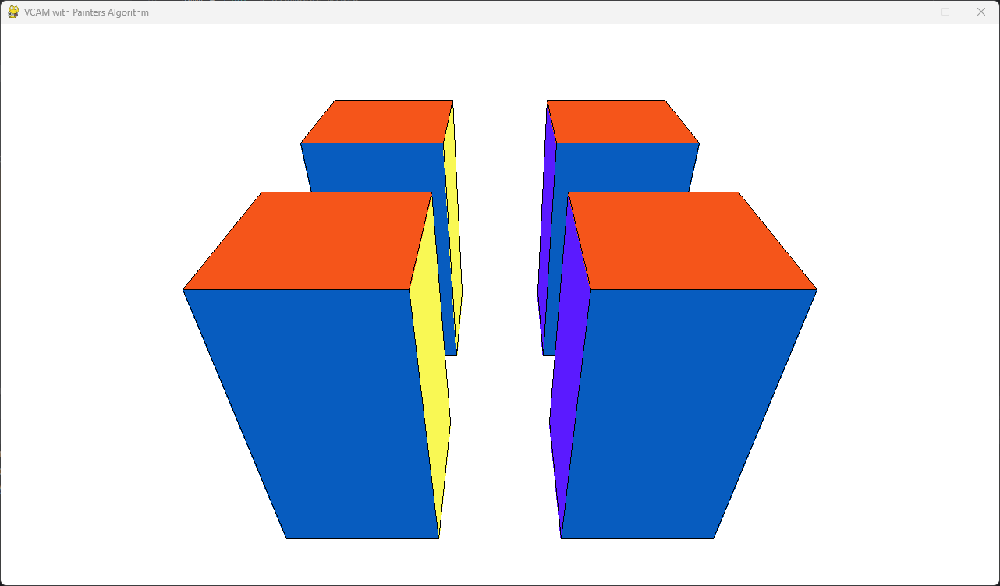
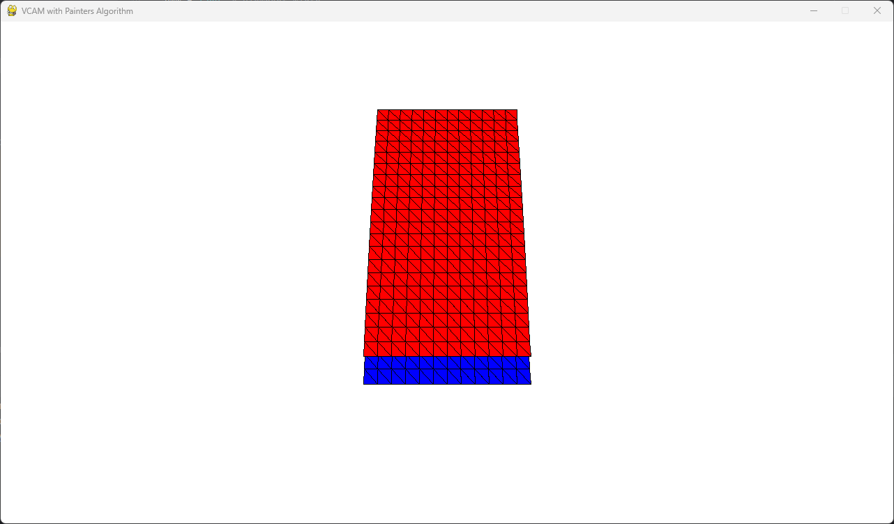
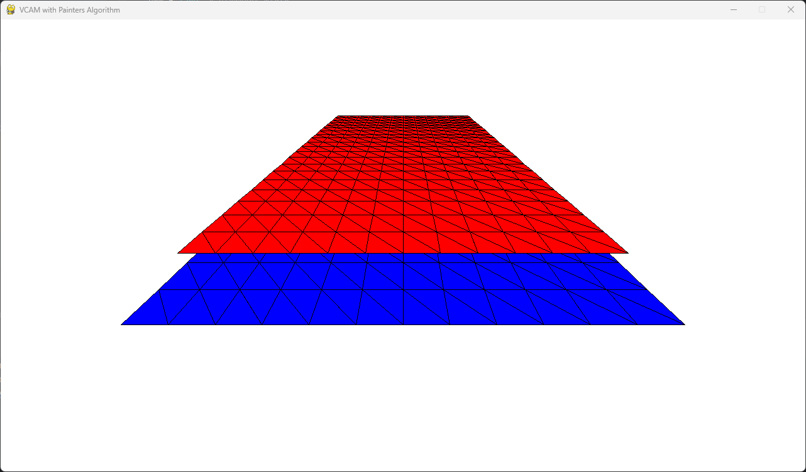
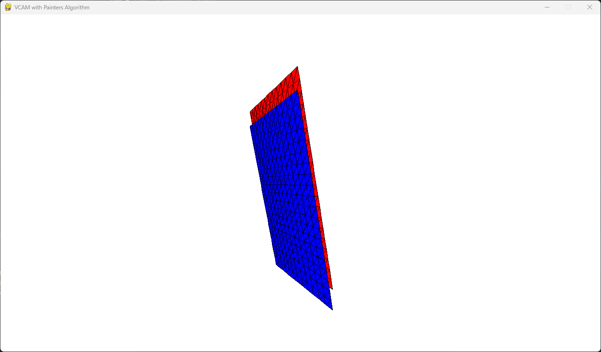

### Virtual camera - project goal

The goal of the exercise was to create a virtual camera. The solution was implemented in Python using the pygame and
numpy libraries. The virtual camera allows the following operations:

1. Moving the camera along the x, y, z axes – keys w, a, s, d, shift, space
2. Rotating around the x, y, z axes – arrow keys and q, e
3. Zooming in and out on the scene – keys i, o
4. Resetting the scene to its initial state – key r

### Run application

First of all you should have Python installed (developed under Python 3.12). Then install requirements:

```bash
pip install -r requirements.txt
```

When you have requirements installed you can run the project:

```bash
py camera.py      # or camera_v1.py
```

### Implementation description

The virtual camera system is based on the camera’s coordinate system, simplifying calculations. The display shows a
fixed scene with edge objects – a series of rectangular boxes resembling buildings along a street. Users can enter
inside these objects.

1. **Camera Movement**: The camera moves using a translation matrix. To simplify this, for each coordinate, a shift
   value is added without multiplying the entire matrix.

2. **Camera Rotation**: Camera rotations use three rotation matrices. The final rotation matrix is made by multiplying
   the matrices for each axis. Then, the vertex coordinates are multiplied by the final matrix.

3. **Zooming**: Zoom is done by changing the distance of the projection plane from the camera. A greater distance means
   a smaller viewing angle, which results in more zoom. The projection plane is perpendicular to the Z-axis, and zoom
   happens by changing the Z coordinate of the projection plane.

4. **Projection**: Transforming the 3D scene into a 2D image uses the camera's position as the center of projection.
   This uses a normalized equation. If the Z coordinate of the projected point is less than 0.001 units from the
   projection plane, it is set to 0.001 for correct rendering of objects between the camera and the projection plane.

### camera.py

The first milestone of the project - wireframe scene.

#### Screenshots







### camera_v1.py

The second milestone of the project - visible surface determination
with [painter's algorithm](https://en.wikipedia.org/wiki/Painter%27s_algorithm).

Additional available operations:

1. Show/hide borders - b key
2. Switch between scenes - 1 for cubes, 2 for planes

> Note: This is a rather simple and not very efficient implementation.

The following assumptions were made:

1. There are no overlapping or cyclically obscuring elements on the scene.
2. Polygons are sorted by their distance from the camera, which is at point (0,0,0), using the
   quicksort algorithm (Python's argsort).
3. The sorting takes into account the vertex of the triangle closest to the camera, not its centroid.

#### Screenshots










